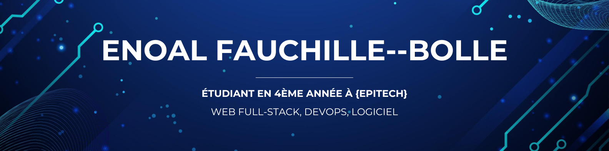
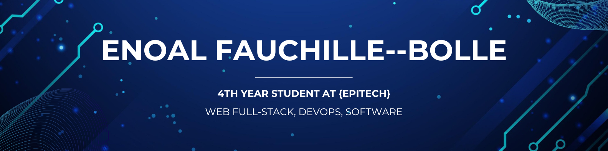

  

    
    <b style="vertical-align: middle;">Version française</b>
  

   

  <!----------------------------------------------------------------------- Banner ----------------------------------------------------------------------->

  

    
  

  <!------------------------------------------------------------------------ Title ------------------------------------------------------------------------>

  <h1 align="center">Salut, moi c'est Enoal Fauchille-Bolle 👋</h1>

  <!------------------------------------------------------------------ Short Description ------------------------------------------------------------------>

  <h3 align="center">Étudiant en 3ème année à Epitech Nantes et développeur passionné.</h3>

  <!------------------------------------------------------------------ Long Description ------------------------------------------------------------------>

  

    Je suis un développeur Full-stack, Logiciel et DevOps avec une forte appétence pour la création de solutions performantes et robustes. Actuellement en 3ème année du cycle d'Expert en Technologies de l'Information , je suis constamment en train d'apprendre et d'explorer de nouvelles technologies .
  

  <!------------------------------------------------------------------ Internship Seeking ------------------------------------------------------------------>

  

     
    🔭 Je suis à la recherche d'un <b>stage de 4 mois d'Avril à Juillet 2026</b> pour mettre mes compétences en pratique et contribuer à des projets innovants.
     
     
    📫 N'hésitez pas à me contacter : <b>enoal.fauchille@gmail.com</b>
  

  <!-------------------------------------------------------------------- Contact Badges -------------------------------------------------------------------->

  

    <!-- LinkedIn -->
    
    <!-- GitHub -->
    
    <!-- Email -->
    
  

   

  <!------------------------------------------------------------------ My Technical Skills ------------------------------------------------------------------>

  <h2 align="center">🚀 Mes Compétences Techniques</h2>

  <table>
    <tr>
      <td align="right" valign="top"><b>Langages</b></td>
      <td align="left" valign="top">
        <!-- TypeScript -->
        
        <!-- JavaScript -->
        
        <!-- C -->
        
        <!-- C++ -->
        
        <!-- Python -->
        
        <!-- Dart -->
        
        <!-- Assembly -->
        
        <!-- Bash -->
        
      </td>
    </tr>
    <tr>
      <td align="right" valign="top"><b>Web & Interface</b></td>
      <td align="left" valign="top">
        <!-- HTML5 -->
        
        <!-- CSS -->
        
        <!-- Markdown -->
        
        <!-- React -->
        
        <!-- Angular -->
        
        <!-- Vue.js -->
        
        <!-- Vite -->
        
        <!-- Flutter -->
        
      </td>
    </tr>
    <tr>
      <td align="right" valign="top"><b>Backend & API</b></td>
      <td align="left" valign="top">
        <!-- Node.js -->
        
        <!-- Express.js -->
        
        <!-- NestJS -->
        
        <!-- TypeORM -->
        
        <!-- Prisma -->
        
        <!-- JWT -->
        
        <!-- Pug -->
        
        <!-- Jinja -->
        
      </td>
    </tr>
    <tr>
      <td align="right" valign="top"><b>Données & Bases de données</b></td>
      <td align="left" valign="top">
        <!-- PostgreSQL -->
        
        <!-- MariaDB -->
        
        <!-- Redis -->
        
        <!-- SQL -->
        
        <!-- YAML -->
        
        <!-- JSON -->
        
        <!-- .env -->
        
      </td>
    </tr>
    <tr>
      <td align="right" valign="top"><b>DevOps & Cloud</b></td>
      <td align="left" valign="top">
        <!-- Nginx -->
        
        <!-- Jenkins -->
        
        <!-- GitHub Actions -->
        
        <!-- Docker -->
        
        <!-- Kubernetes -->
        
        <!-- Azure -->
        
        <!-- DigitalOcean -->
        
      </td>
    </tr>
    <tr>
      <td align="right" valign="top"><b>Outils & Environnement</b></td>
      <td align="left" valign="top">
        <!-- Git -->
        
        <!-- GitHub -->
        
        <!-- CommitLint -->
        
        <!-- ESLint -->
        
        <!-- Prettier -->
        
        <!-- Fedora -->
        
        <!-- Ubuntu -->
        
        <!-- Bash -->
        
        <!-- Zsh -->
        
        <!-- Tmux -->
        
        <!-- Regex -->
        
      </td>
    </tr>
    <tr>
      <td align="right" valign="top"><b>Logiciels & IA</b></td>
      <td align="left" valign="top">
        <!-- Google Chrome -->
        
        <!-- Visual Studio Code -->
        
        <!-- Canva -->
        
        <!-- Figma -->
        
        <!-- Trello -->
        
        <!-- Wakatime -->
        
        <!-- Claude -->
        
        <!-- Gemini -->
        
        <!-- GitHub Copilot -->
        
        <!-- ChatGPT -->
        
      </td>
    </tr>
    <tr>
      <td align="right" valign="top"><b>Embarqué & IoT</b></td>
      <td align="left" valign="top">
        <!-- Micro:bit -->
        
      </td>
    </tr>
    <tr>
      <td align="right" valign="top"><b>Ce que je veux apprendre</b></td>
      <td align="left" valign="top">
        <!-- Go -->
        
        <!-- Rust -->
        
        <!-- Java -->
        
        <!-- Spring -->
        
        <!-- AWS -->
        
        <!-- Grafana -->
        
        <!-- Lighthouse -->
        
        <!-- Prometheus -->
        
        <!-- Metabase -->
        
      </td>
    </tr>
  </table>

   

  <!-------------------------------------------------------------------- My Projects -------------------------------------------------------------------->

  <h2 align="center">✨ Mes Projets</h2>

  <table width="100%">
    <tr>
      <td width="50%" valign="top">
        <h3><a href="https://github.com/Enoal-Fauchille-Bolle/AREA">AREA - Automation Platform</a></h3>
        

          Une plateforme d'automatisation de type IFTTT/Zapier. Elle permet de connecter des services, déclencher des actions et créer des workflows via une API REST, des clients web et mobiles.
        

        

          
          
          
          
          
          
        

      </td>
      <td width="50%" valign="top">
        <h3><a href="https://github.com/Enoal-Fauchille-Bolle/Zappy">Zappy - Jeu Stratégie IA</a></h3>
        

          Un jeu multijoueur en réseau (client-serveur) de gestion de ressources et de stratégie IA. Le projet inclut un serveur en C, un client GUI et des clients IA.
        

        

          
          
          
          
        

      </td>
    </tr>
    <tr>
      <td width="50%" valign="top">
        <h3><a href="https://github.com/Enoal-Fauchille-Bolle/Arcade">Arcade - Retro Gaming</a></h3>
        

          Une plateforme de jeu rétro modulaire en C++. Elle utilise des bibliothèques dynamiques pour charger différents jeux (ex: Pacman, Snake) et moteurs graphiques (ex: SFML, Ncurses).
        

        

          
          
          
          
          
        

      </td>
      <td width="50%" valign="top">
        <h3><a href="https://github.com/Enoal-Fauchille-Bolle/MyFTP">MyFTP - Serveur FTP</a></h3>
        

          Un serveur FTP léger et conforme à la RFC, écrit en C. Il gère l'authentification, les transferts de données en mode actif/passif et les clients multiples.
        

        

          
          
        

      </td>
    </tr>
  </table>

  

    
  

   

  <!-------------------------------------------------------------------- GitHub Stats -------------------------------------------------------------------->

  <h2 align="center">📊 Mes Statistiques GitHub</h2>
  

    <!-- Profile Details -->
    
     
    <!-- GitHub Stats -->
    
    <!-- GitHub Streak -->
    
     
    <!-- Top Languages -->
    
    <!-- WakaTime Stats -->
    
     
  

   

  <!------------------------------------------------------------------ Random Dev Quote ------------------------------------------------------------------>

  <h2 align="center">✍️ Citation de Développeur aléatoire</h2>
  

    
  

   

  <!------------------------------------------------------------------- Profile Stats ------------------------------------------------------------------->

  <h2 align="center">📈 Profile Stats</h2>
  

    
  

   

  <!------------------------------------------------------------------- Made with love ------------------------------------------------------------------->

  

    <i>Hey ! Merci d'avoir visité mon profil. Passez une excellente journée ! 🚀</i>
     
    <i>Fait avec ❤️ par Enoal Fauchille-Bolle</i>
  

  

 

<!----------------------------------------------------------------------- Banner ----------------------------------------------------------------------->

  

<!------------------------------------------------------------------------ Title ------------------------------------------------------------------------>

<h1 align="center">Hi, I'm Enoal Fauchille-Bolle 👋</h1>

<!------------------------------------------------------------------ Short Description ------------------------------------------------------------------>

<h3 align="center">3rd year student at Epitech Nantes and passionate developer.</h3>

<!------------------------------------------------------------------ Long Description ------------------------------------------------------------------>

  I am a Full-stack, Software, and DevOps developer with a strong interest in creating high-performance and robust solutions. Currently in my 3rd year of the Information Technology Expert program, I am constantly learning and exploring new technologies.

<!------------------------------------------------------------------ Internship Seeking ------------------------------------------------------------------>

  📫 Feel free to contact me: <b>enoal.fauchille@gmail.com</b>

<!-------------------------------------------------------------------- Contact Badges -------------------------------------------------------------------->

  <!-- LinkedIn -->
  
  <!-- GitHub -->
  
  <!-- Email -->
  

 

<!------------------------------------------------------------------ My Technical Skills ------------------------------------------------------------------>

<h2 align="center">🚀 My Technical Skills</h2>

<table>
  <tr>
    <td align="right" valign="top"><b>Languages</b></td>
    <td align="left" valign="top">
      <!-- TypeScript -->
      
      <!-- JavaScript -->
      
      <!-- C -->
      
      <!-- C++ -->
      
      <!-- Python -->
      
      <!-- Dart -->
      
      <!-- Assembly -->
      
      <!-- Bash -->
      
    </td>
  </tr>
  <tr>
    <td align="right" valign="top"><b>Web & Interface</b></td>
    <td align="left" valign="top">
      <!-- HTML5 -->
      
      <!-- CSS -->
      
      <!-- Markdown -->
      
      <!-- React -->
      
      <!-- Angular -->
      
      <!-- Vue.js -->
      
      <!-- Vite -->
      
      <!-- Flutter -->
      
    </td>
  </tr>
  <tr>
    <td align="right" valign="top"><b>Backend & API</b></td>
    <td align="left" valign="top">
      <!-- Node.js -->
      
      <!-- Express.js -->
      
      <!-- NestJS -->
      
      <!-- TypeORM -->
      
      <!-- Prisma -->
      
      <!-- JWT -->
      
      <!-- Pug -->
      
      <!-- Jinja -->
      
    </td>
  </tr>
  <tr>
    <td align="right" valign="top"><b>Data & Databases</b></td>
    <td align="left" valign="top">
      <!-- PostgreSQL -->
      
      <!-- MariaDB -->
      
      <!-- Redis -->
      
      <!-- SQL -->
      
      <!-- YAML -->
      
      <!-- JSON -->
      
      <!-- .env -->
      
    </td>
  </tr>
  <tr>
    <td align="right" valign="top"><b>DevOps & Cloud</b></td>
    <td align="left" valign="top">
      <!-- Nginx -->
      
      <!-- Jenkins -->
      
      <!-- GitHub Actions -->
      
      <!-- Docker -->
      
      <!-- Kubernetes -->
      
      <!-- Azure -->
      
      <!-- DigitalOcean -->
      
    </td>
  </tr>
  <tr>
    <td align="right" valign="top"><b>Tools & Environment</b></td>
    <td align="left" valign="top">
      <!-- Git -->
      
      <!-- GitHub -->
      
      <!-- CommitLint -->
      
      <!-- ESLint -->
      
      <!-- Prettier -->
      
      <!-- Fedora -->
      
      <!-- Ubuntu -->
      
      <!-- Bash -->
      
      <!-- Zsh -->
      
      <!-- Tmux -->
      
      <!-- Regex -->
      
    </td>
  </tr>
  <tr>
    <td align="right" valign="top"><b>Software & AI</b></td>
    <td align="left" valign="top">
      <!-- Google Chrome -->
      
      <!-- Visual Studio Code -->
      
      <!-- Canva -->
      
      <!-- Figma -->
      
      <!-- Trello -->
      
      <!-- Wakatime -->
      
      <!-- Claude -->
      
      <!-- Gemini -->
      
      <!-- GitHub Copilot -->
      
      <!-- ChatGPT -->
      
    </td>
  </tr>
  <tr>
    <td align="right" valign="top"><b>Embedded & IoT</b></td>
    <td align="left" valign="top">
      <!-- Micro:bit -->
      
    </td>
  </tr>
  <tr>
    <td align="right" valign="top"><b>What I Want to Learn</b></td>
    <td align="left" valign="top">
      <!-- Go -->
      
      <!-- Rust -->
      
      <!-- Java -->
      
      <!-- Spring -->
      
      <!-- AWS -->
      
      <!-- Grafana -->
      
      <!-- Lighthouse -->
      
      <!-- Prometheus -->
      
      <!-- Metabase -->
      
    </td>
  </tr>
</table>

 

<!-------------------------------------------------------------------- My Projects -------------------------------------------------------------------->

<h2 align="center">✨ My Projects</h2>

<table width="100%">
  <tr>
    <td width="50%" valign="top">
      <h3><a href="https://github.com/Enoal-Fauchille-Bolle/AREA">AREA - Automation Platform</a></h3>
      

        An automation platform similar to IFTTT/Zapier. It allows connecting services, triggering actions, and creating workflows via a REST API, web, and mobile clients.
      

      

        
        
        
        
        
        
      

    </td>
    <td width="50%" valign="top">
      <h3><a href="https://github.com/Enoal-Fauchille-Bolle/Zappy">Zappy - AI Strategy Game</a></h3>
      

        A networked multiplayer game (client-server) involving resource management and AI strategy. The project includes a C server, a GUI client, and AI clients.
      

      

        
        
        
        
      

    </td>
  </tr>
  <tr>
    <td width="50%" valign="top">
      <h3><a href="https://github.com/Enoal-Fauchille-Bolle/Arcade">Arcade - Retro Gaming</a></h3>
      

        A modular retro gaming platform in C++. It uses dynamic libraries to load different games (e.g., Pacman, Snake) and graphics engines (e.g., SFML, Ncurses).
      

      

        
        
        
        
        
      

    </td>
    <td width="50%" valign="top">
      <h3><a href="https://github.com/Enoal-Fauchille-Bolle/MyFTP">MyFTP - FTP Server</a></h3>
      

        A lightweight, RFC-compliant FTP server written in C. It handles authentication, data transfers in active/passive modes, and multiple clients.
      

      

        
        
      

    </td>
  </tr>
</table>

  

 

<!-------------------------------------------------------------------- GitHub Stats -------------------------------------------------------------------->

<h2 align="center">📊 My GitHub Statistics</h2>

  <!-- Profile Details -->
  
   
  <!-- GitHub Stats -->
  
  <!-- GitHub Streak -->
  
   
  <!-- Top Languages -->
  
  <!-- WakaTime Stats -->
  
   

 

<!------------------------------------------------------------------ Random Dev Quote ------------------------------------------------------------------>

<h2 align="center">✍️ Random Developer Quote</h2>

  

 

<!------------------------------------------------------------------- Profile Stats ------------------------------------------------------------------->

<h2 align="center">📈 Profile Stats</h2>

  

 

<!------------------------------------------------------------------- Made with love ------------------------------------------------------------------->

  <i>Hey! Thanks for visiting my profile. Have a great day! 🚀</i>
   
  <i>Made with ❤️ by Enoal Fauchille-Bolle</i>

